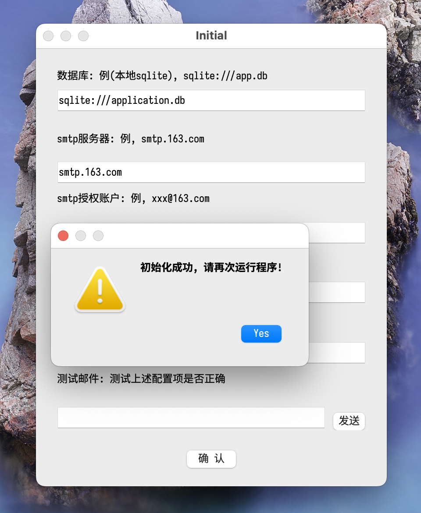

# Knowledge Hub Desktop APP Based on PyQt5
---
## Tech Stack
- **python3.8+**
- **PyQt5**

## Features
- db initial with dsn( both local or remote)
- user create
- add note that binding to current user
- email client config/send email
- shortcut support

## TODO
- reset password
- temp note
- syntax highlight
- pyInstaller build

## ScreenShot
- config window

- login window

- registry window

- main window
the left list widget will list new 20 note default.

- create new file
use left corner `File->New File` menu or `Ctrl+n` shortcut both can create new file

- new file 
default use markdown syntax, use shortcut `Ctrl+t` will toggle show origin content and render content

- and so on...

## Refactor
will refactor this project to Qt5(C++)